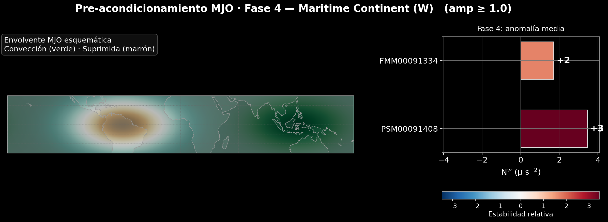
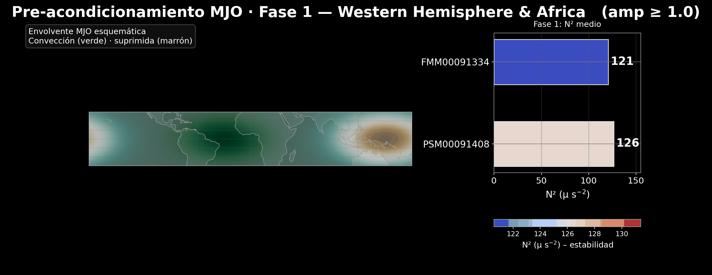

<h1 align="center">🌍 Cómo cambia la estabilidad atmosférica tropical durante la MJO</h1>

<p align="center">
  <strong>Análisis ambiental reproducible con 46 años de radiosondeos históricos de Palau y Chuuk</strong>
</p>

<p align="center">
  
  
  
  
</p>

<p align="center">
  
</p>

> **En una frase:** este proyecto transforma décadas de mediciones tomadas por
> globos meteorológicos en indicadores diarios que permiten observar cómo cambia
> la estabilidad de la atmósfera tropical a medida que avanza la MJO.

<p align="center">
  <a href="https://camilobedoyac.github.io/mjo-atmospheric-stability/hist-unificado-site/hist_unificado.html"><strong>Explorar la visualización interactiva</strong></a>
  ·
  <a href="Trabajo1_Clima.ipynb">Ver el notebook</a>
  ·
  <a href="outputs/daily_2stations.csv">Consultar los datos procesados</a>
  ·
  <a href="data/README.md">Revisar las fuentes</a>
</p>

---

## El proyecto en números

| Cobertura temporal | Registros estación-día | Estaciones | Fases MJO | Registros con MJO activa |
|:---:|---:|---:|---:|---:|
| 1980–2025 | 33.096 | 2 | 8 | 19.656 |

Se considera **MJO activa** cuando la amplitud del índice RMM es igual o
superior a 1. Los 19.656 valores corresponden a registros de estación por día,
no a 19.656 fechas únicas.

## ¿Por qué importa esta pregunta?

La **Oscilación Madden–Julian (MJO)** es una extensa zona de nubosidad, lluvia y
circulación atmosférica que se desplaza hacia el este a través de los trópicos.
Su paso puede modificar el entorno en el que se forman las nubes y ocurre la
convección.

Este trabajo estudia una parte de ese entorno: la estabilidad de la capa baja
de la atmósfera. En términos sencillos:

- una atmósfera más estable ofrece mayor resistencia al movimiento vertical del aire;
- una atmósfera menos estable facilita la mezcla vertical, aunque la formación de lluvia también depende de la humedad y de otros procesos;
- el indicador **N²** resume esa resistencia. Valores mayores de N² representan una capa más estable.

La pregunta central es:

> **¿La estabilidad atmosférica cambia de manera reconocible entre las ocho
> fases de la MJO en dos estaciones tropicales del Pacífico?**

## Área de estudio y datos

El análisis utiliza radiosondeos de dos estaciones con alta cobertura de
temperatura en la capa de interés:

| Estación | Identificador IGRA | Ubicación | Registros diarios procesados |
|---|---|---|---:|
| Koror | `PSM00091408` | Palau | 16.625 |
| Truk/Chuuk | `FMM00091334` | Estados Federados de Micronesia | 16.471 |

Las fuentes son oficiales:

- **Radiosondeos:** Integrated Global Radiosonde Archive (IGRA), NOAA/NCEI.
- **Actividad y fase de la MJO:** índice diario RMM, Australian Bureau of Meteorology.

Los datos crudos no se publican en GitHub debido a su volumen. Sus enlaces de
descarga, identificadores, periodos y huellas SHA-256 están documentados en
[`data/README.md`](data/README.md) y
[`data/input_manifest.sha256`](data/input_manifest.sha256).

## Del dato al resultado

El proyecto implementa un flujo completo en Python:

1. **Descarga y lectura eficiente:** procesa archivos históricos IGRA sin cargar todo el archivo descomprimido en memoria.
2. **Control de calidad:** interpreta el formato de ancho fijo y descarta valores ausentes o marcados como inválidos.
3. **Selección reproducible:** conserva las dos estaciones con mayor proporción de perfiles útiles entre 40 candidatas tropicales.
4. **Cálculo diario:** estima N² en la capa de 980–850 hPa y promedia los sondeos disponibles por día.
5. **Referencia climática:** construye una climatología por día calendario para 1981–2010.
6. **Cálculo de anomalías:** resta a cada observación el valor climatológico correspondiente a su estación y fecha del año.
7. **Integración con la MJO:** une cada día con la fase y amplitud del índice RMM.
8. **Comunicación de resultados:** genera tablas, figuras, una animación y una visualización interactiva.
9. **Validación automática:** comprueba insumos, ejecución, tablas y artefactos finales.

## Hallazgos principales

La estabilidad relativa de la capa baja no fue constante durante el ciclo de
la MJO:

- En las dos estaciones se observaron anomalías negativas durante las fases iniciales 1–2.
- En ambas aparecieron anomalías positivas durante las fases 4–6.
- En **Palau**, el mayor aumento medio ocurrió en la **fase 4**: aproximadamente **+3,46 µ s⁻²**.
- En **Chuuk**, el mayor aumento medio ocurrió en la **fase 6**: aproximadamente **+3,03 µ s⁻²**.
- El desfase entre los máximos indica que la evolución del entorno no fue idéntica en ambos lugares.

| Estación | Fase 1 | Fase 2 | Fase 4 | Fase 5 | Fase 6 | Máximo medio |
|---|---:|---:|---:|---:|---:|---:|
| Palau | −1,23 | −2,23 | **+3,46** | +2,89 | +1,99 | Fase 4 |
| Chuuk | −2,04 | −1,40 | +1,71 | +2,19 | **+3,03** | Fase 6 |

<sub>Medias de la anomalía de N², expresadas en µ s⁻², para días con amplitud
RMM ≥ 1. La referencia es la climatología diaria 1981–2010 de cada estación.</sub>

Estos resultados muestran una **asociación** entre la fase de la MJO y la
estabilidad atmosférica local. No demuestran causalidad y no constituyen un
modelo de pronóstico.

<p align="center">
  
</p>

<p align="center">
  <sub>Recorrido visual por las ocho fases. Las envolventes verde y marrón son
  esquemáticas; las barras proceden de los datos calculados para las estaciones.</sub>
</p>

## Visualización interactiva

El histograma interactivo permite explorar los resultados sin ejecutar código:

- alternar entre Palau y Chuuk;
- comparar las ocho fases de la MJO;
- cambiar el umbral mínimo de amplitud RMM;
- alternar entre densidad y número de observaciones;
- ajustar la cantidad de intervalos del histograma.

### [➡️ Abrir la visualización interactiva](https://camilobedoyac.github.io/mjo-atmospheric-stability/hist-unificado-site/hist_unificado.html)

El archivo
[`hist-unificado-site/hist_unificado.html`](hist-unificado-site/hist_unificado.html)
es autocontenido: después de descargarlo también puede abrirse localmente sin
conexión a internet.

## Valor técnico y profesional

Este proyecto demuestra capacidades transferibles a proyectos de clima,
hidrología, calidad del aire, oceanografía y monitoreo ambiental:

| Capacidad | Evidencia dentro del proyecto |
|---|---|
| Ingeniería de datos | Descarga, lectura incremental, limpieza e integración de archivos meteorológicos históricos |
| Análisis ambiental | Conversión de perfiles verticales en indicadores físicos interpretables |
| Series de tiempo | Agregación diaria, climatologías, anomalías y comparación por fases |
| Control de calidad | Reglas físicas, hashes de insumos, detección de duplicados y equivalencia CSV–Parquet |
| Programación reproducible | Dependencias fijadas, rutas portables y ejecución automatizada del notebook |
| Visualización de datos | Figuras estáticas, animación, PDF y explorador interactivo con Plotly |
| Comunicación | Traducción de un análisis atmosférico a mensajes comprensibles y verificables |

## Tecnologías utilizadas

`Python` · `pandas` · `NumPy` · `Matplotlib` · `Plotly` · `Cartopy` ·
`Jupyter` · `PyArrow/Parquet` · `Pillow` · `nbclient` · `Git`

## Estructura del repositorio

```text
mjo-atmospheric-stability/
├── Trabajo1_Clima.ipynb          # Notebook fuente del análisis
├── reproduce.py                  # Ejecución y validación de extremo a extremo
├── clima_outputs.py              # Generación determinista del HTML interactivo
├── requirements.txt              # Dependencias fijadas
├── data/
│   ├── README.md                 # Fuentes, periodos y trazabilidad
│   ├── station_selection.csv     # Selección auditada de estaciones
│   └── input_manifest.sha256     # Huellas del snapshot validado
├── outputs/
│   ├── daily_2stations.csv       # Resultado diario procesado
│   ├── daily_2stations.parquet   # Resultado equivalente en formato columnar
│   └── Trabajo1_Clima.executed.ipynb
├── figs/                         # Figuras canónicas por estación
├── mjo_phases/                   # Resultados de N² por fase
├── mjo_phases_anom/              # Anomalías de N² por fase
├── hist-unificado-site/          # Visualización interactiva autocontenida
└── mjo_precond.gif               # Animación de las ocho fases
```

## Cómo reproducir el análisis

### Requisitos

- Git.
- Python **3.11 o 3.12**.
- Conexión a internet para descargar los datos crudos desde sus fuentes oficiales.
- Espacio libre para los archivos descargados y los resultados.

La primera ejecución puede tardar aproximadamente entre 15 y 20 minutos,
aunque el tiempo depende del equipo y de la velocidad de descarga.

### 1. Clonar el repositorio

```bash
git clone https://github.com/CamiloBedoyaC/mjo-atmospheric-stability.git
cd mjo-atmospheric-stability
```

### 2. Crear el entorno

<details open>
<summary><strong>Windows PowerShell</strong></summary>

```powershell
py -3.11 -m venv .venv
.\.venv\Scripts\python -m pip install --upgrade pip
.\.venv\Scripts\python -m pip install -r requirements.txt
```

</details>

<details>
<summary><strong>macOS o Linux</strong></summary>

```bash
python3.11 -m venv .venv
.venv/bin/python -m pip install --upgrade pip
.venv/bin/python -m pip install -r requirements.txt
```

</details>

Si se utiliza Python 3.12, sustituya `python3.11` por `python3.12`.

### 3. Ejecutar usando las fuentes oficiales actuales

En Windows PowerShell:

```powershell
.\.venv\Scripts\python reproduce.py --skip-input-check
```

En macOS o Linux:

```bash
.venv/bin/python reproduce.py --skip-input-check
```

En una clonación nueva, el notebook descarga los archivos oficiales en carpetas
ignoradas por Git. La opción `--skip-input-check` omite únicamente la comparación
con los hashes del snapshot histórico; la ejecución y las validaciones de las
salidas siguen activas.

Como las fuentes oficiales se actualizan, esta modalidad puede incorporar datos
posteriores al snapshot publicado y producir conteos ligeramente diferentes.

### 4. Reproducción exacta del snapshot publicado

Para repetir de forma idéntica los resultados publicados se necesitan los cinco
insumos cuyas rutas y huellas SHA-256 aparecen en
[`data/input_manifest.sha256`](data/input_manifest.sha256). Después de ubicarlos
en esas rutas, la verificación y ejecución exactas se realizan sin
`--skip-input-check`:

```powershell
.\.venv\Scripts\python reproduce.py
```

Actualmente el snapshot crudo no tiene un depósito público permanente ni DOI.
Por tanto, una tercera persona puede reproducir completamente el procedimiento
con las fuentes oficiales vigentes, pero no garantizar una identidad bit a bit
con los archivos históricos hasta que ese snapshot sea archivado. Los resultados
procesados correspondientes al snapshot sí están incluidos en `outputs/`.

Al finalizar deben aparecer estos mensajes:

```text
Tablas: CSV y Parquet equivalentes (... filas).
Artefactos gráficos e interactivos: presentes e íntegros.
Reproducción completa y validada.
```

El notebook ejecutado se guarda en
[`outputs/Trabajo1_Clima.executed.ipynb`](outputs/Trabajo1_Clima.executed.ipynb).
El notebook fuente no se sobrescribe.

### ¿Qué valida `reproduce.py`?

- ejecución completa de las 33 celdas sin admitir errores;
- igualdad numérica entre los resultados CSV y Parquet;
- ausencia de fechas duplicadas por estación;
- presencia e integridad de las figuras PNG;
- ocho cuadros en el GIF y ocho páginas en cada PDF;
- estructura completa de los archivos HTML;
- independencia respecto al directorio desde el que se invoque el script.

<details>
<summary><strong>Auditoría opcional de la selección de estaciones</strong></summary>

Para volver a evaluar las 40 estaciones candidatas:

```powershell
.\.venv\Scripts\python.exe reproduce.py --skip-input-check --recompute-selection
```

Esta auditoría descarga muchos más archivos y tarda considerablemente más. No
es necesaria para la reproducción normal porque la selección validada ya está
guardada en `data/station_selection.csv`.

</details>

## Reproducibilidad y actualización de las fuentes

Los resultados mostrados en este repositorio corresponden a un snapshot con:

- radiosondeos disponibles hasta el **5 de septiembre de 2025**;
- índice RMM local hasta el **24 de febrero de 2024**.

Por eso, los radiosondeos posteriores a febrero de 2024 conservan sus valores
de N², pero no participan en los composites por fase de la MJO.

Las fuentes oficiales se actualizan. Una ejecución pública futura reproduce el
mismo procedimiento con los archivos vigentes, pero sus conteos o resultados
pueden cambiar ligeramente. Los resultados procesados originales permanecen en
`outputs/`, y el manifiesto documenta las huellas del snapshot utilizado. Esta
distinción evita presentar como idéntica una reproducción basada en datos que
han cambiado con el tiempo.

## Alcance y limitaciones

- El estudio representa dos estaciones del Pacífico tropical, no todo el trópico.
- Los radiosondeos IGRA no forman una serie homogeneizada; cambios de instrumento, ubicación o práctica pueden introducir discontinuidades.
- N² se calcula como una aproximación seca de capa entre 980 y 850 hPa; no incorpora explícitamente los efectos de la humedad.
- Los composites resumen asociaciones observadas y no prueban causalidad ni capacidad predictiva.
- Las envolventes espaciales de las figuras por fase son esquemáticas; no son campos atmosféricos observados.

## Créditos

Proyecto desarrollado en coautoría por:

- [Juan Camilo Bedoya Carmona](https://github.com/CamiloBedoyaC)
- [Linda Catalina Correa](https://github.com/LindaCatalina)

No se atribuye el proyecto completo a una sola persona. Las responsabilidades
individuales deben describirse únicamente de acuerdo con la participación real
que cada autor pueda acreditar.

## Fuentes

- [NOAA/NCEI — Integrated Global Radiosonde Archive](https://www.ncei.noaa.gov/products/weather-balloon/integrated-global-radiosonde-archive)
- [Australian Bureau of Meteorology — MJO y Real-time Multivariate MJO Index](https://www.bom.gov.au/climate/mjo/)

Los enlaces directos de descarga, los periodos y los detalles de procedencia se
encuentran en [`data/README.md`](data/README.md).

---

<p align="center">
  <strong>Ciencia de datos ambientales · análisis reproducible · visualización clara</strong>
</p>
